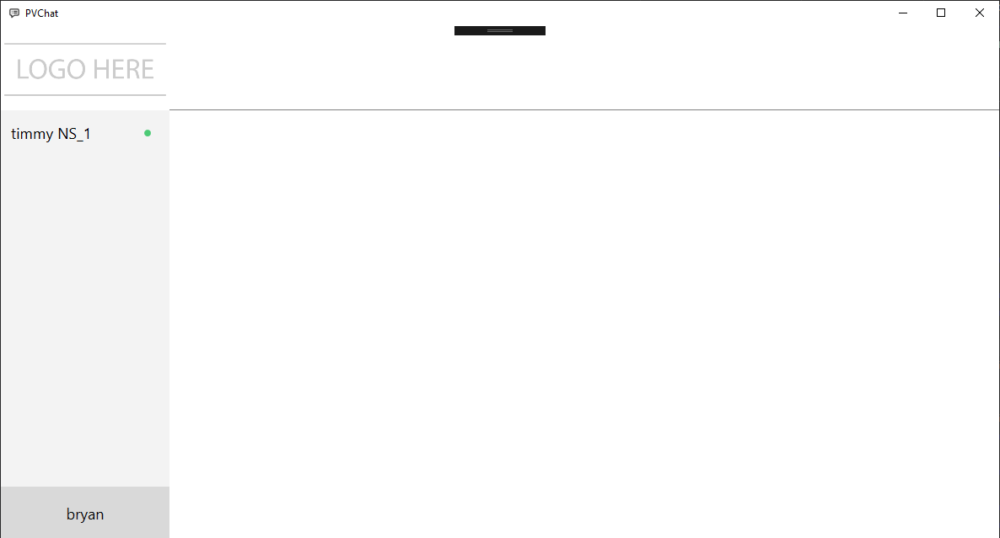
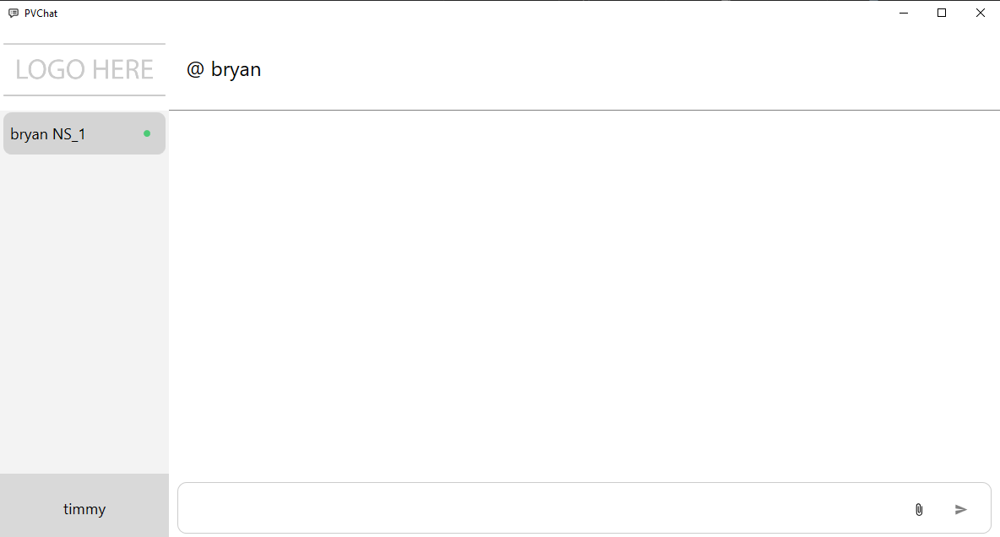

# SignalRChat
This was a prototype testing repository I used when developing and learning SignalR to create the live chat feature in the WPF application.
The chat uses MVVM and very basic UI, the main goal was to learn and understand the SignalR data pipeline for sending and receiving objects in real time.

## Demo
Login to the App

---
Empty chat between two users on the same database: Timmy and Bryan.

---
Timmy says hello to Bryan

Bryan Receives message notification

---
Bryan Reads the message

Timmy receives read receipt from Bryan

---

Bryan wants to show timmy a cool image 

---

Timmy receives the picture

